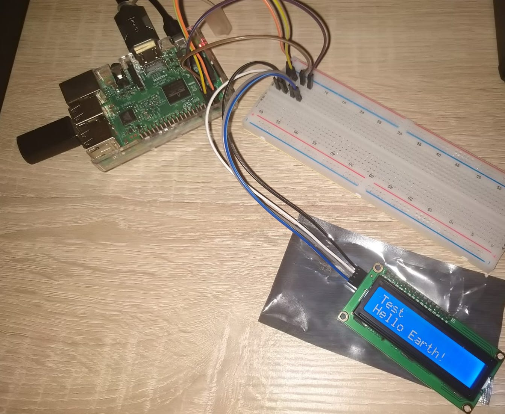

## RaspberryPi lcd i2c display driver
Adding an lcd display to your Raspberry Pi can increase mobility of your projects and give you whole new dimension of interfacing possibilities. This project with setup steps below will help you to easily connect and run your i2c lcd display on Raspberry Pi.


<hr/>

### Setup
#### Connect i2c display to Raspberry Pi
Connection is simple, from the image below we can see pins on Raspberry Pi that should be connected

* 5V power (RPi) => VCC (Display)
* Ground (RPi) => GND (Display)
* SDA (RPi) => SDA (Display)
* SCL (RPi) => SCL (Display)


#### Enable i2c display
After display is connected turn Raspberry Pi on and perform next steps in order to activate display
``` bash
# Install required packages
sudo apt install i2c-tools python-smbus

# Enable i2c interface
sudo raspi-config # Interfaceing Options > I2C > Activate

# Reboot
sudo reboot

# Check address of display
sudo i2cdetect -y 1
# It is probably 0x27, but if it's some other address, init display with it
```
<hr/>

### Test driver
Driver consists of test code, just simply run command below to test it
``` bash
python3 ./lcd_i2c_driver.py
```
<hr/>

### References
[Display worksheet](https://www.openhacks.com/uploadsproductos/eone-1602a1.pdf)
